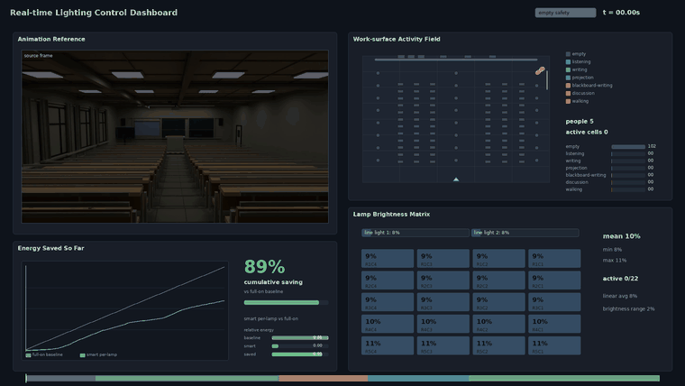

# 智能节能教室照明控制动画演示

本项目是一个面向课程展示和论文方法说明的 **小型动画概念模拟**。它围绕天津大学常见教室布局，用 Blender 制作 20 秒教室场景动画，演示“人员活动变化如何影响工作表面照明需求，并进一步驱动逐灯亮度控制”的基本思路。

这不是一个真实可部署的照明控制系统，也不是工程级照度仿真软件。项目重点是把论文中的控制概念用直观动画讲清楚：有人活动的区域更亮，无人区域降低亮度，投影、自习、课间等场景有不同的照明响应。

推荐先看正式综合展示视频：[`outputs/videos/companion/lighting_dashboard_video.mp4`](outputs/videos/companion/lighting_dashboard_video.mp4)



上方 GIF 只是 README 的轻量预览；正式展示请以 MP4 视频为准。

## 项目目标

这个项目想回答一个简单问题：如果教室照明系统能够知道“哪里有人、人在做什么”，它应该怎样调节不同灯具的亮度？

因此，动画没有追求完整工程部署，而是集中展示三个点：

- **活动驱动照明**：学生入场、课间走动、观看投影、自习写作等活动会产生不同照明需求。
- **逐灯控制**：20 个顶灯和 2 条前方线灯独立变化，而不是整间教室统一调光。
- **节能可解释**：dashboard 同步显示人员活动、工作表面 cell、灯具亮度矩阵和相对能耗节省。

仓库现在包含两部分内容：一部分是 Blender 动画演示，用来直观看效果；另一部分是独立的论文方法代码原型，用 mock 数据把论文中的完整计算链路写出来。两者互不依赖，动画不调用论文原型代码，论文原型也不读取动画数据。

## 动画演示思路

动画部分使用一条简化的数据链路来模拟论文中的控制思想：

```text
人员位置与活动
    -> 工作表面 cell 活动状态
    -> 局部照明需求
    -> 22 个灯具的逐灯亮度
    -> Blender 动画与同步 dashboard
```

几个术语：

- **cell**：桌面、过道、黑板、投影幕布上的小块物理工作表面单元。它不是图像像素，也不是灯具。
- **activity**：活动类别，包括 `empty`、`listening`、`writing`、`projection`、`blackboard-writing`、`discussion`、`walking`。
- **lamp**：独立可控灯具。本项目包含 20 个顶灯和 2 条前方线灯，共 22 个 lamp。

灯光变化通过 Blender 中真实 Area Light 的能量变化实现，没有靠整体曝光、环境光、材质变白或后期调亮来伪造灯光。

## 演示时间线

| 时间 | 阶段 | 人员活动 | 灯光响应 |
| --- | --- | --- | --- |
| 0.0s-2.2s | empty safety | 教室无人 | 保持低亮安全照明，空间仍可读。 |
| 2.2s-8.0s | class mode | 学生从前门进入并入座 | 座位区和讲台附近亮度逐步提高。 |
| 8.0s-10.8s | break mode | 部分学生在过道和门口活动 | 过道、门侧和活动区域亮度提高。 |
| 10.8s-14.0s | projection mode | 学生坐下观看投影 | 前区强光降低，投影幕布成为视觉中心。 |
| 14.0s-20.0s | self study | 大部分学生离开，少数人留下自习 | 有人写作区域保持较亮，无人区域降到低亮。 |

## 核心实现

### 教室模型

场景是一个简化但比例可信的阶梯教室，参考天津大学常见教室布局。模型包含 12 排固定连排桌椅、前半平地、后半阶梯、讲台、黑板、投影幕布、门窗和天花灯具。主视角以后排看向讲台，便于同时观察座位、前区和天花灯光。

### 人员活动

人物是低多边形简化模型，用于表达入场、入座、课间走动、投影观看和自习等状态。路径约束为“门口 -> 过道 -> 排入口 -> 座位”，避免用突然消失或穿越桌椅来表达移动。

### 工作表面 cell

脚本将桌面、过道、黑板和投影幕布离散为 cell。每个时间点根据附近人员位置和活动类别，为 cell 计算主导活动和活动分数。dashboard 和热力图中的 activity field 就来自这些 cell 数据。

### 逐灯亮度

每个灯具根据周围 cell 的照明需求计算亮度。自习时，留座学生附近灯具更亮；课间时，过道和门口附近灯具更亮；投影时，前区强光降低。灯具亮度被导出为时间序列，并同步用于动画和灯光矩阵视频。

### 能耗估算

能耗只做相对估算：用灯具亮度时间序列积分，比较 `full_on` 与 `smart_per_lamp_dimming`。它用于展示节能趋势，不代表真实电表读数或灯具功率测量。

## 论文方法代码原型

[`paper_method/`](paper_method/) 是一套与动画解耦的论文方法原型代码，用来展示“如果真正按论文方法组织系统，代码结构应如何展开”。它不导入 Blender，不读取 `outputs/data`，也不依赖动画里预设的人物路径。

这里的 `mock` 指模拟输入和占位模块：代码用合成数据代替真实 VGGT、Swin-Tiny-FPN、多相机输入和灯具硬件，只用于跑通论文接口与控制链路；真实模型和硬件接入不属于当前项目范围。

这套原型实际实现的是论文方法的数据流闭环：

```text
VGGT mock 点图与语义掩码
    -> 三维工作表面 cell
    -> 3DGS 辅助输出 dynamic_residual, visibility_weight, base_reflectance
    -> cell 特征 F_i(t)
    -> Swin-Tiny-FPN 三任务 head mock 输出 O_t(i), A_t(i,k), L_t(i)
    -> 灯具贡献矩阵 M(i,g)
    -> 环境光 L_day,t(i) 与目标需求 R_t(i)
    -> L-BFGS-B / projected-gradient 控制优化
    -> 灯具控制向量 c_t
```

运行后，它会生成一组独立结果：工作表面 cell、mock 感知状态、灯具贡献矩阵 `M(i,g)`、目标照明需求 `R_t(i)`、预测亮度、欠照/过照指标、相对能耗指标和灯具控制向量 `c_t`。这些结果位于 [`outputs/paper_method_demo/`](outputs/paper_method_demo/)。

这部分代码的作用，是说明论文方法的数据流和控制逻辑如何在代码层面闭合。它不证明真实视觉模型精度、真实节能效果，也不代表系统已经具备实际部署能力。

## 输出文件

| 类型 | 文件 | 说明 |
| --- | --- | --- |
| 综合展示视频 | [`lighting_dashboard_video.mp4`](outputs/videos/companion/lighting_dashboard_video.mp4) | 推荐首先观看，包含主动画、活动场、灯矩阵和节能曲线。 |
| 主动画 | [`smart_lighting_demo.mp4`](outputs/videos/smart_lighting_demo.mp4) | Blender 渲染的 20 秒教室动画。 |
| 活动分析视频 | [`activity_heatmap_video.mp4`](outputs/videos/companion/activity_heatmap_video.mp4) | 主动画与 work-surface activity heatmap 同步展示。 |
| 灯光矩阵视频 | [`light_matrix_video.mp4`](outputs/videos/companion/light_matrix_video.mp4) | 主动画与 22 个灯具亮度矩阵同步展示。 |
| README 预览 GIF | [`dashboard_preview.gif`](outputs/videos/dashboard_preview.gif) | README 顶部轻量预览。 |
| 补充 GIF | [`activity_heatmap.gif`](outputs/videos/activity_heatmap.gif), [`light_control_matrix.gif`](outputs/videos/light_control_matrix.gif) | 单独展示活动热力图和灯具亮度矩阵。 |
| 数据 | [`outputs/data/`](outputs/data/) | 时间线、人员、cell、灯光和能耗 CSV。 |
| 论文方法原型输出 | [`outputs/paper_method_demo/`](outputs/paper_method_demo/) | mock 论文链路生成的 cell、感知、贡献矩阵、目标需求和控制结果。 |
| 研究图 | [`outputs/figures/`](outputs/figures/) | 时间线、亮度曲线、热力图、能耗对比等静态图。 |
| Blender 场景 | [`outputs/blender/`](outputs/blender/) | 生成的 `.blend` 文件。 |

## 数据说明

动画演示数据：

| 文件 | 用途 |
| --- | --- |
| [`demo_timeline.csv`](outputs/data/demo_timeline.csv) | 五个演示阶段的开始时间、结束时间和文字说明。 |
| [`light_brightness_timeseries.csv`](outputs/data/light_brightness_timeseries.csv) | 22 个独立灯具的亮度时间序列。 |
| [`occupancy_timeseries.csv`](outputs/data/occupancy_timeseries.csv) | 人员位置、坐/站状态和活动类别。 |
| [`work_surface_cells.csv`](outputs/data/work_surface_cells.csv) | 工作表面 cell 的位置、法向和语义标签。 |
| [`activity_cell_timeseries.csv`](outputs/data/activity_cell_timeseries.csv) | 每个 cell 在每个时间点的主导活动和活动分数。 |
| [`energy_summary.csv`](outputs/data/energy_summary.csv) | 全开基线与智能逐灯调光的相对能耗对比。 |

论文方法原型输出：

| 文件 | 用途 |
| --- | --- |
| [`cells.csv`](outputs/paper_method_demo/cells.csv) | mock VGGT/语义表面流程生成的三维工作表面 cell。 |
| [`perception_state.csv`](outputs/paper_method_demo/perception_state.csv) | 三任务 head 的 mock 输出，包括 `F_i(t)`、`O_t(i)`、`A_t(i,k)`、`L_t(i)` 和 `board_front` 标记。 |
| [`contribution_matrix.csv`](outputs/paper_method_demo/contribution_matrix.csv) | 灯具贡献矩阵 `M(i,g)`。 |
| [`target_demand.csv`](outputs/paper_method_demo/target_demand.csv) | 环境光、目标需求、亮度上限、预测亮度、欠照和过照。 |
| [`control_result.csv`](outputs/paper_method_demo/control_result.csv) | 每个 mock 场景下的灯具控制向量 `c_t`。 |
| [`run_summary.json`](outputs/paper_method_demo/run_summary.json) | 场景、求解器、控制量、欠照/过照、相对能耗、目标满足率、mock 光照估计误差、3DGS 辅助统计和方法对齐说明。 |

## 仓库结构

```text
blender/                     Blender 教室模型、动画和数据导出脚本
paper_method/                独立论文方法代码原型
scripts/                     图表、GIF 和 companion 视频生成脚本
outputs/videos/              主动画、dashboard、分析视频和 GIF
outputs/data/                CSV 数据
outputs/paper_method_demo/   论文方法原型输出
outputs/figures/             研究图表
outputs/blender/             Blender 场景文件
true_classroom_images/       教室参考照片
```

## 复现方式

以下命令均在仓库根目录执行。若使用 Docker、devcontainer 或其他隔离环境，请先进入对应环境中的项目目录。

语法检查：

```bash
python3 -m py_compile blender/create_realistic_classroom_preview.py blender/create_smart_lighting_demo.py scripts/create_research_figures.py scripts/create_companion_videos.py paper_method/*.py scripts/run_paper_method_demo.py
```

重新导出关键帧、Blender 场景和 CSV 数据：

```bash
blender --background --python blender/create_smart_lighting_demo.py -- --keyframes-only
```

生成研究图和 GIF：

```bash
python3 scripts/create_research_figures.py
```

生成 companion 视频：

```bash
python3 scripts/create_companion_videos.py
```

运行独立论文方法代码原型：

```bash
python3 scripts/run_paper_method_demo.py
```

重新渲染完整主动画会耗时较长：

```bash
blender --background --python blender/create_smart_lighting_demo.py
```

## 限制

本项目是课程/论文展示用的动画概念模拟，不是可部署的照明控制系统。它没有接入真实传感器、真实灯具功率曲线、日照数据或照度计校准。人物模型、活动识别、cell 需求和能耗估算都服务于“把方法讲清楚”，不应被理解为实际工程性能结论。论文方法原型中的 `solver_success=true` 只表示优化器收敛，不表示每个 cell 的目标亮度都被完全满足；是否欠照或过照应查看 `target_demand.csv` 和 `run_summary.json` 中的质量指标。
